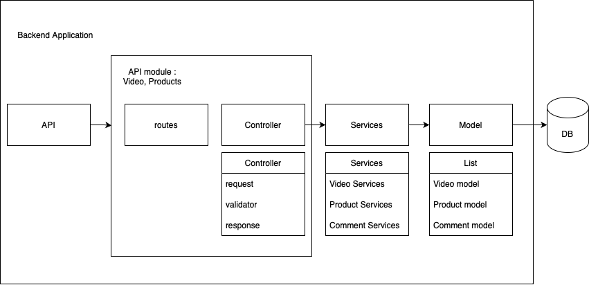

# Tokopedia Play Clone App

This repository contains backend and frontend for the final project of
the course "Generasi Gigih 3.0 - Fullstack Engineering" by
[Goto Impact Foundation](https://www.goto-impact.org).

## Database Schema


From the schema above, we can see that there are 3 collections in the database:

- `videos`
- `products`
- `comments`

### videos

This collection contains data about videos. The schema is as follows:

```json
{
  "_id": "objectId",
  "title": "string",
  "thumbnail_url": "string",
  "url": "string",
  "views": "number",
  "store_name" : "string"
}
```

### products

This collection contains data about products. The schema is as follows:

```json
{
  "_id": "objectId",
  "title": "string",
  "thumbnail_url" : "string",
  "price": "number",
  "discount" : "number",
  "product_link": "string",
  "video_id": "objectId | reference on videos._id",
}
```

### comments

This collection contains data about comments that are posted by users in a video. The schema is as follows:

```json
{
  "_id": "objectId",
  "username": "string",
  "body": "string",
  "timestamp": "date",
  "videoId": "objectId | reference on videos._id",
}
```

## API Structure



As shown in the image above, the API structure is as follows:

- `Client` is the client that will consume the API
- `Backend` is the a server that serve the API that is integrated with the database
- `DB` is a database that stores data (MongoDB)


the `Backend` impleted 3 layers architecture included grouped api by module: 

- `API module` is the layer that grouping controler and routes by module such as Video module and Product module
- `Controller` is the layer that will handle the request from the `Client` and send the response back to the `Client` to `routes`
- `Services` is the layer that handle business logic and manipulating data to process from `Model` to `Model`
- `Models` is the layer that will handle the data from the `DB` and send the data back to the `Services`

I implemented 3N layers plus api (controllers and routes) grouped by module (Video, Product) to make it easier for me to develop and maintain in the future.

## List APIs


As shown in the image above, the list of APIs is as follows:

### GET api/videos

This API return a list of videos.

- URL Params:
    - None
- Data Params:
    - None
- Headers:
    - None
- Success Response
    - Code: 200
    - Content:
    ```json
        {
            "data" : {
                "videos" : [
                    {
                    "_id": "string",
                    "title": "string",
                    "thumbnail_url": "string"
                    },
                    {
                    "_id": "string",
                    "title": "string",
                    "thumbnail_url": "string"
                    }
                ]
            }
        }
    ```

### GET api/videos/:id

This API return video with the specified id.

- URL Params:
    - required: `id=[string]`
- Data Params:
    - None
- Headers:
    - None
- Success Response
    - Code: 200
    - Content:

    ```json
        {
            "data" : {
                "video" : {
                    "_id": "string",
                    "title": "string",
                    "thumbnail_url": "string"
                }
            }
        }
    ```

- Error Response
    - Code: 404
    - Content:

    ```json
          {
            "message": "Video tidak ditemukan"
          }
    ```

### GET api/videos/:id/products

This API return a list of products that are related to the video with the specified id.

- URL Params:
    - required: `id=[string]`
- Data Params:
    - None
- Headers:
    - None
- Success Response
    - Code: 200
    - Content:

    ```json
        {
            "data" : {
                "products" : [
                    {
                    "_id": "string",
                    "title": "string",
                    "price": "number",
                    "product_link": "string",
                    "videoId": "string",
                    "createdAt": "string(timestamps)",
                    "updatedAt": "string(timestamps)"
                    },
                    {
                    "_id": "string",
                    "title": "string",
                    "price": "number",
                    "product_link": "string",
                    "videoId": "string",
                    "createdAt": "string(timestamps)",
                    "updatedAt": "string(timestamps)"
                    }
                ]
            }
        }
    ```

### GET api/videos/:id/comments

This API will return a list of comments that are related to the video with the specified id.

- URL Params:
    - required: `id=[string]`
- Data Params:
    - None
- Headers:
    - None
- Success Response
    - Code: 200
    - Content:

    ```json
        {
            "data" : {
                "comments" : [
                    {
                        "_id": "string",
                        "username": "string",
                        "comment": "string",
                        "video_id": "string",
                        "createdAt": "string(timestamps)",
                        "updatedAt": "string(timestamps)"
                    },
                    {
                        "_id": "string",
                        "username": "string",
                        "body": "string",
                        "video_id": "string",
                        "createdAt": "string(timestamps)",
                        "updatedAt": "string(timestamps)"
                    }
                ] 
            }
        }
    ```

### POST api/videos/:id/comment

This API will create a new comment for the video with the specified id.

- URL Params:
    - required: `id=[string]`
- Data Params:
    - required: `username=[string]`
    - required: `comment=[string]`
- Headers:
- Success Response
    - Code: 201
    - Content:

    ```json
          {
            "status" : "success",
            "message" : "Komentar berhasil ditambahkan",
            "data" : {
                "commentId": "string",
            }
          }
    ```

- Error Response
    - Code: 400
    - Content:

    ```json
        {
        "status": "validation failed",
        "message": "\"username\" is required"
        }
    ```

    ```json
        {
        "status": "validation failed",
        "message": "\"comment\" is required"
        }
    ```

**Additional APIs**

### POST api/products

- URL Params:
    - none
- Data Params:
    - required: `title=[string]`
    - required: `product_link=[string]`
    - required: `price=[number]`
    - required: `video_id`

- example 
    ```json
        {
            "title" : "product 1",
            "product_link" : "www",
            "price" : 5000,
            "vide0_id" : "vieo_id"
        }
    ```

- Headers:
- Success Response
    - Code: 201
    - Content:

    ```json
          {
            "status" : "success",
            "message" : "Produk berhasil ditambahkan",
            "data" : {
                "commentId": "string",
            }
          }
    ```

- Error Response
    - Code: 400
    - Content:

    ```json
        {
        "status": "validation failed",
        "message": "\"title\" is required"
        }
    ```

    ```json
        {
        "status": "validation failed",
        "message": "\"product_link\" is required"
        }
    ```

     ```json
        {
        "status": "validation failed",
        "message": "\"price\" is required"
        }
    ```

     ```json
        {
        "status": "validation failed",
        "message": "\"video_id\" is required"
        }
    ```

### GET api/videos?search=""

This API return a list of videos.

- URL Params:
    - None
- Data Params:
    - None
- Query Params:
    - required: `?search=[string]`

- example 
    `api/videos?search=test`

- Headers:
    - None
- Success Response
    - Code: 200
    - Content:
    ```json
        {
            "data" : {
                "videos" : [
                    {
                    "_id": "string",
                    "title": "string",
                    "thumbnail_url": "string"
                    },
                    {
                    "_id": "string",
                    "title": "string",
                    "thumbnail_url": "string"
                    }
                ]
            }
        }
    ```


## How to run in local

1. Pull this docker image

    ```bash
    docker pull ryanprtma/gigih-final-project:latest
    ```

2. Run docker container
    ```bash
    docker run -dp 80:80 ryanprtma/gigih-final-project
    ```
    or you can run on your own port
    ```bash
    docker run -dp your-port:80 ryanprtma/gigih-final-project
    ```

3. Now the server is running on port 80:80. So you can access it via `localhost`
